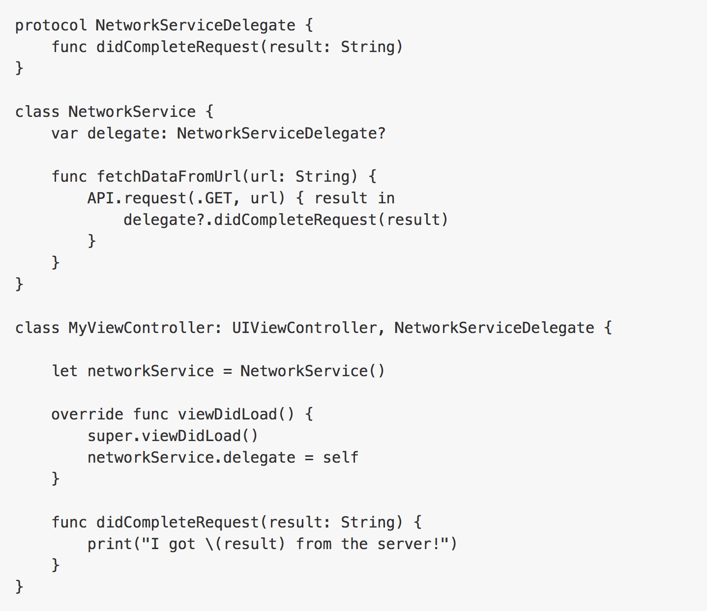

Servicios con protocolos en Swift
===

<p align="center">
	
</p>

## Descripción

<p align="justify">
A menudo cuando construimos nuestra aplicación tenemos que consumir servicios, lo que buscamos es reutilizar la parte de código que nos permite consumir un servicio y utilizar su respuesta. Una solución a esto es el uso de protocolos y delegados, podemos crear una clase que tenga los métodos necesarios para el consumo de servicios y un protocolo que se ejecute en una respuesta éxitosa o fallida, a su vez este protocolo puede ser implmentado en nuestros ViewControllers y obtendriamos la respuesta de la clase que ejecuta los servicios, así usar la información en nuestro Controller.
</p>

## Código

1.- Creamos la clase Base Services

```Swift
import Foundation

class BaseServices: NSObject {
	override init() {
        super.init()
        
    }
}
```

2.- Agregamos una variable URLSession que contendra nuestro request (cabeceras y body) y ahí obtendremos la respuesta (data, response, error). Así mismo una variable URLSessionDataTask que es la que ejecuta nuestro servicio.

```Swift
class BaseServices: NSObject {
    
    var session: URLSession?
    var dataTask: URLSessionDataTask?
    
    var delegate: ServiciosDelegate?
    
    override init() {
        super.init()
        session = URLSession(configuration: .default)

    }
    
    func submitRequest(url: URL) {
        
        var request = URLRequest(url: url)
        request.httpMethod = "GET"
        request.setValue("application/json", forHTTPHeaderField: "Content-Type")
        request.setValue("application/json", forHTTPHeaderField: "Accept")
        
        dataTask = session?.dataTask(with: request, completionHandler: completionHandler)
        dataTask?.resume()
    }
    
    fileprivate func completionHandler(data: Data?, response: URLResponse?, error: Error?) -> Void {
		
    }
}
```

3.- Si nos damos cuentaun handler es una función pasada como parametro, entonces el completionHandler de session lo podemos usar como una función abajo sólo por limpieza del código. Dentro de este handler debería ir nuestro protocolo que pasaría las respuestas si es éxito o error a un controller o clase que lo implemente. Creamos nuestro protocolo y lo agregamos al handler.

```Swift
import Foundation

protocol ServiciosDelegate {
    func respuestaExistosa(objecto: Any)
    func respuestaFallida(error: Any)
}

class BaseServices: NSObject {
    
    var session: URLSession?
    var dataTask: URLSessionDataTask?
    
    var delegate: ServiciosDelegate?
    
    override init() {
        super.init()
        session = URLSession(configuration: .default)

    }
    
    func submitRequest(url: URL) {
        
        var request = URLRequest(url: url)
        request.httpMethod = "GET"
        request.setValue("application/json", forHTTPHeaderField: "Content-Type")
        request.setValue("application/json", forHTTPHeaderField: "Accept")
        
        dataTask = session?.dataTask(with: request, completionHandler: completionHandler)
        dataTask?.resume()
    }
    
    fileprivate func completionHandler(data: Data?, response: URLResponse?, error: Error?) -> Void {
        guard error == nil else {
            print("error conexión: \(String(describing: error)) ")
            if let _delegate = delegate {
                _delegate.respuestaFallida(error: error ?? "")
            }
            return
        }
        guard response != nil else {
            print("no hay response")
            return
        }
        if let _data = data {
            do {
                let json = try JSONSerialization.jsonObject(with: _data, options: []) as? [String: Any]
                guard let _json = json else {
                    return
                }
                if let _delegate = delegate {
                    _delegate.respuestaExistosa(objecto: _json)
                }
            } catch {
                
            }
            
        }
    }
}
```
4.- Ahora sólo falta implementar el protocolo en el controller y asignarlo como delegado.

```Swift
import Foundation
import UIKit

class BuscarClienteViewController: ViewController, ServiciosDelegate {
    
    @IBOutlet weak var txtCliente: UITextField!
    @IBOutlet weak var txtNombre: UILabel!
    @IBOutlet weak var activity: UIActivityIndicatorView!
    
    var baseUrl = "http://erp.netsec.com.mx:8086/conttempo/cliente/"
    var url: URL!
    var service: BaseServices!
    
    override func viewDidLoad() {
        super.viewDidLoad()
        
        self.service = BaseServices()
        service.delegate = self
    }
    
    override func viewWillAppear(_ animated: Bool) {
        super.viewWillAppear(animated)
        
        self.txtNombre.text = ""
        activity.isHidden = true
    }
    
    @IBAction func buscarCliente(_ sender: UIButton) {
        // Limpiamos si ya hay una consulta anterior
        self.txtNombre.text = ""

        // Obtenemos el id del cliente
        let cliente = txtCliente.text
        
        if let _cliente = cliente{
            print("_cliente: \(_cliente)")
            
            // Construimos la cadena
            let strUrl = "\(baseUrl)\(_cliente)"
            print("strUrl: \(strUrl)")
            
            // Construimos la url
            url = URL(string: strUrl)
            
            // Enviamos el servicio y nos asignamos como delegados de la respuesta del servicio
            activity.isHidden = false
            service.submitRequest(url: url)
        }
    }

    
    func respuestaExistosa(objecto: Any) {
        print(objecto)
        let dicData = objecto as? [String: Any]
        
        if let _dicData = dicData {
            if let dic = _dicData["Data"] as? [[String:Any]],
                !dic.isEmpty {
                let nombre = dic[0]["Nombre"] as? String ?? ""
                print("nombre: \(nombre)")
                DispatchQueue.main.async {
                    self.activity.isHidden = true
                    self.txtNombre.text = nombre
                }
            }
        }
    }
    
    func respuestaFallida(error: Any) {
        print(error)
    }
    
}
```

en el nombre de la clase le decimos que usaremos ese protocolo, en el viewDidLoad lo asignamos como delegado, en respuestaExitosa y respuestaFallida cachamos el objeto que viene del servicio, y ya podemos desplegarlo en la vista.


## Fuente

* <a href="http://marinbenc.com/why-you-shouldnt-use-delegates-in-swift">Why you shouldn’t use delegates in Swift</a>

* <a href="https://www.objc.io/issues/5-ios7/from-nsurlconnection-to-nsurlsession/">NSURLconnection to NSURLSession</a>


